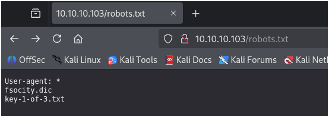

# 🧪 Mr.Robot 
In this lab assignment we will be downloading Mr.Robot vm to use as a simulated target.
CTF 

---

## 🎯 Objective
This VM has three keys hidden in different locations. Your goal is to find all three. Each key is progressively difficult to find.

The VM isn't too difficult. There isn't any advanced exploitation or reverse engineering. The level is considered beginner-intermediate.


---

## 🔧 Lab Procedure

### Step 1 — Run Nmap (kali)
<details> 
<summary> Scan the network for the machine</summary>

```bash
┌──(kali㉿kali)-[~]
└─$ nmap -sS -T4 10.10.10.100-200
Starting Nmap 7.95 ( https://nmap.org ) at 2025-11-06 15:29 EST
Nmap scan report for 10.10.10.103
Host is up (0.00037s latency).
Not shown: 997 filtered tcp ports (no-response)
PORT    STATE  SERVICE
22/tcp  closed ssh
80/tcp  open   http
443/tcp open   https
MAC Address: 08:00:27:48:75:1E (PCS Systemtechnik/Oracle VirtualBox virtual NIC)

```

Port 80/tcp http is open

</details>

### Step 2 - Investigate discovered IP address
<details>
<summary>Investigate </summary>

- Visit IP Address in browswer
- Locate robots.txt in directories (ex. IPaddress/robots.txt)
###
Found 3 more directories
- User-agent: *
- fsocity.dic
- key-1-of-3.txt (contained first key)


</details>

###
Used Dirbuster to bruteforce the webserver directory


- /wp-login was located


### Step 3 - Getting username and password for Wordpress login found\
<details> 
<summary> username and password </summary>


</details>


---

## ✅ Completion Checklist
- [x] flag1: 073403c8a58a1f80d943455fb30724b9
- [] flag2:
- [] flag3:  

📸 **Screenshot Evidence:** Add proof of command outputs, GUI confirmations, or configuration screens.

---

## 🧾 Reflection
> Summarize what you learned or observed.  
> Describe any issues encountered and how you solved them.  
> Note one real-world use case for this skill.

---

## 🧩 Version Control
- Version: 1.0  
- Linked Curriculum: _(Add relevant Professor Messer domain/topic here)_  
- Last Updated: _{{ date }}_

---

