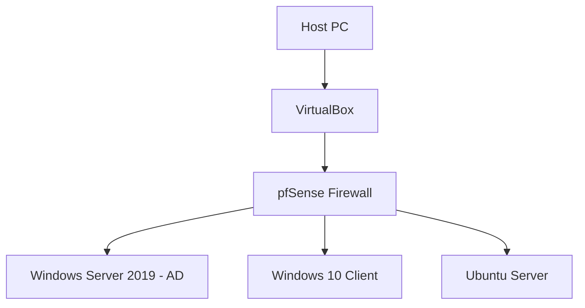

# 🧱 Home Lab Specifications

## 🖥️ Host Machine
| Component | Specification |
|------------|----------------|
| **CPU** | AMD Ryzen 7 5800X |
| **RAM** | 32 GB DDR4 |
| **Storage** | 1 TB NVMe SSD + 2 TB HDD |
| **GPU** | NVIDIA RTX 3060 |
| **Network** | 1 Gbps Ethernet |
| **Operating System** | Windows 11 Pro (Host) |

## 🪟 Virtualization Platform
| Software | Version | Notes |
|-----------|----------|-------|
| **VirtualBox** | 7.0.x | Main virtualization platform |
| **VMware Workstation** | (Optional) | For alternative testing |

## 🧩 Virtual Machines
| VM | OS | Purpose | Resources |
|----|----|----------|------------|
| **Ubuntu Server** | 24.04 LTS | Linux CLI practice, web server | 2 CPU, 4GB RAM, 40GB disk |
| **Windows 10 Pro** | 22H2 | Client management, admin tools | 2 CPU, 4GB RAM, 60GB disk |
| **Windows Server 2019** | Core | Active Directory & networking | 4 CPU, 8GB RAM, 80GB disk |
| **pfSense** | Latest | Firewall & router | 1 CPU, 2GB RAM, 10GB disk |

## 🌐 Network Layout

## 🧰 Tools & Utilities
- PowerShell, CMD, and Bash scripting
- Wireshark, Nmap, Zenmap
- Remote Desktop, SSH, SCP
- Sysinternals Suite
- GNS3 (optional for advanced networking)

## 🔒 Security & Backups
- Weekly VM snapshots  
- Regular exports of `.vbox` and `.vdi` files  
- Isolated test network for experiments  
